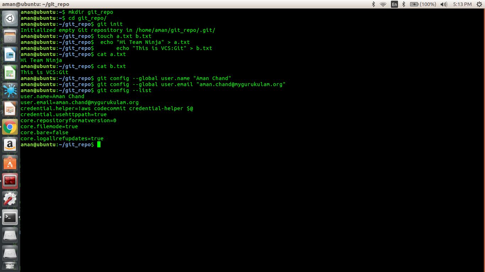
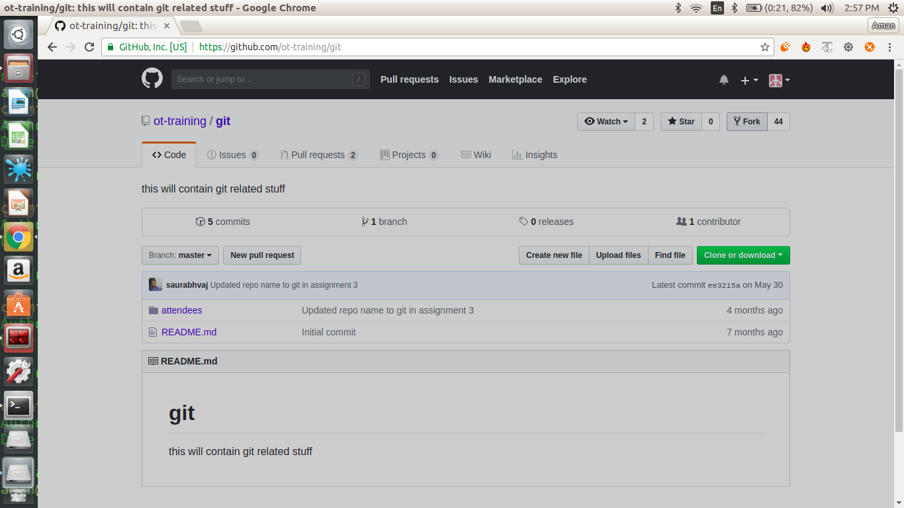
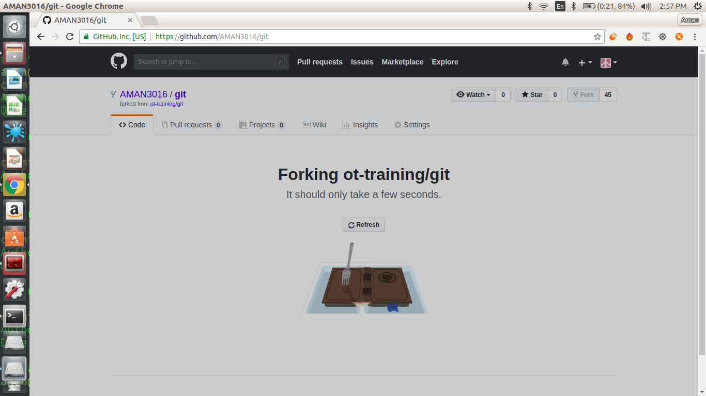

# Assignment1:

* Initialize a directory as git repository
```git init  ```

* Write "Hi Team Ninja" into a.txt 
```echo "Hi Team Ninja" > a.txt```

* Write "This is VCS:Git" into b.txt
```echo "This is VCS:Git" > b.txt```

* Set git config variables.
```git config --global user.name "Aman chand" 
   git config --global user.email "aman.chand@mygurukulam.org"
```


* Commit both files.
```git add .
   git commit -m "added two files"
```


* Create a branch ninja
```git branch ninja```

* Switch into branch ninja
```git checkout ninja ```

* Update file b.txt with ""This is VCS:Git. This is ninja branch"
```echo "This is VCS:Git. This is ninja branch" > b.txt


* Check for the difference made in the file.
```git diff```


* Commit your changes in ninja branch.
```git add b.txt
   git commit -m "updated b.txt with branch ninja"
```


* Check difference between last two commits.
```git diff <commit-id-of-previous-commit> ```


* Rename your file b.txt to c.txt
```mv b.txt c.txt```

* Commit your changes.
```git add c.txt
   git commit 
```
* Remove file c.txt.
      rm c.txt
      


* Commit your changes.
```git add .
   git commit -m "remove c.txt"
```
* Create a file text.txt and add it.
```touch text.txt
   git status
   git add text.txt
```   
* Remove it from the staging area.
```git rm --cached text.txt```


Assignment2:

* Create a account on github.com.

  - created with username AMAN3016

* Fork ot-training/git repo into your account.

- above at the right you will get the fork options just click it 



- process of forking started



- fork done and you can see the repository ContinuousIntegration in your account 


* Clone your repo into your machine.
```git clone https://github.com/AMAN3016/git.git```


Assignment3:

* Add a file to the attendees directory that describes you (ex. filename wouild be your name like saurabh.vajpayee.txt).
```touch aman.chand.txt
   echo "hi this is aman " > aman.chand.txt 
```

* Commit your changes. Write a meaningful message like "Added information about YOUR NAME HERE."
```git add .
   git commit -m "Added information about Aman Chand in aman.chand.txt"
```


* Save your changes into remote repo.
```git push orgin master```


* Check list of changes in your repo.
```git log```


* Add your name into attendees/assignments/day1/attendees.md
```git status
   git add .
   git commit -m "updated attendees.md"
```


